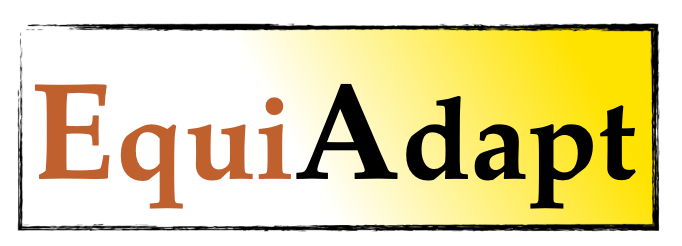

<p align="center">
    <br>
    
    <br>
<p>

<h3 align="center">
<p>Make any existing neural network architecture equivariant! :rocket:
</h3>
<br>


# Understanding Canonicalization


EquiAdapt is a [PyTorch](https://pytorch.org) package that provides a flexible and efficient way to make *any* neural network architecture (including large foundation models) equivariant, instead of redesigning and training from scratch. This is done by learning to canonicalize transformed inputs, before feeding them to the prediction model.

You can play with this concept in the provided [tutorial](tutorials/images/instance_segmentation_group_equivariant_canonicalization.ipynb) for equivariant adaptation of the Segment-Anything Model (SAM, [Kirillov et. al, 2023](https://arxiv.org/abs/2304.02643)) and images from Microsoft COCO ([Lin et. al, 2014](https://arxiv.org/abs/1405.0312)) dataset for instance segmentation.

# Easy to integrate :rocket:

Equiadapt enables users to obtain equivariant versions of existing neural networks with a few lines of code changes:
```diff
  import torch
  import torch.nn.functional as F

+ from equiadapt.images.canonicalization.discrete_group import GroupEquivariantImageCanonicalization
+ from equiadapt.images.canonicalization_networks import ESCNNEquivariantNetwork

  device = torch.device("cuda" if torch.cuda.is_available() else "cpu")

+ canonicalization_network = ESCNNEquivariantNetwork(...) ### create a canonicalization network
+ canonicalizer = GroupEquivariantImageCanonicalization(canonicalization_network, ...) ### wrap it using equiadapt's canonicalization wrapper

  model = torch.hub.load('pytorch/vision:v0.10.0', 'resnet50', pretrained=True).to(device)
  optimizer = torch.optim.Adam(model.parameters())

  train_dataset = datasets.CIFAR10(root="dataset_path", train=True, download=False)
  train_loader = torch.utils.data.DataLoader(train_dataset, batch_size=512, shuffle=True)

  model.train()
  for epoch in range(100):
      for inputs, targets in data:
          inputs = inputs.to(device)
          targets = targets.to(device)

          optimizer.zero_grad()

+         inputs_canonicalized = canonicalizer(inputs) ### canonicalize the inputs
          outputs = prediction_network(inputs_canonicalized) ### pass the canonicalized input data
+         outputs = canonicalizer.invert_canonicalization(outputs) ### optional (if you to invert the outputs for your equivariant task)

          loss = F.cross_entropy(outputs, targets)
+         loss += canonicalizer.get_prior_regularization_loss() ### prior regularization is recommended for pretrained networks

          loss.backward()

          optimizer.step()
```

# Details on using `equiadapt` library

1. Create a `canonicalization network` (or use our provided networks: for images, in `equiadapt/images/canonicalization_networks/`).
   
```
canonicalization_network = ESCNNEquivariantNetwork(...)
```  
2. Wrap it using `equiadapt` wrappers to form a `canonicalizer`.
    
  To create your custom canonicalizer, you must inherit `BaseCanonicalization` and define `canonicalize()` and, optionally, `invert_canonicalization()`. Please refer to [this](equiadapt/images/canonicalization) for custom image canonicalizers.   
```
canonicalizer = GroupEquivariantImageCanonicalization(canonicalization_network, ...)
```

3. Use this wrapper with your code to canonicalize the input data.  

```
inputs_canonicalized = canonicalizer(inputs)
```

4. Define your prediction network and pass the canonicalized input data
```
prediction_network = torch.hub.load('pytorch/vision:v0.10.0', 'resnet50', pretrained=True)
outputs = prediction_network(inputs_canonicalized)
```

5. Optionally, if required, you can "invert" the canonicalization for equivariant tasks
```
outputs = canonicalizer.invert_canonicalization(outputs)
```

6. The entire setup is end-to-end trainable. Additionally, you can use `.add_prior_regularizer(loss)` to use prior regularization, which is helpful for equivariant adaptation of large pretrained models ([Mondal et. al, 2023](https://proceedings.neurips.cc/paper_files/paper/2023/hash/9d5856318032ef3630cb580f4e24f823-Abstract-Conference.html))
```
loss = CrossEntropyLoss(outputs, y)
loss = canonicalizer.add_prior_regularizer(loss)
loss.backward()
```

# Setup instructions
### Setup Conda environment 

To create a conda environment with the necessary packages:

```
conda env create -f conda_env.yaml
conda activate equiadapt
pip install -e .
```

### Setup Hydra 
- Create a `.env` file in the root of the project with the following content:
  ```
    export HYDRA_JOBS="/path/to/your/hydra/jobs/directory"
    export WANDB_DIR="/path/to/your/wandb/jobs/directory"
    export WANDB_CACHE_DIR="/path/to/your/wandb/cache/directory"
    export DATA_PATH="/path/to/your/data/directory"
    export CHECKPOINT_PATH="/path/to/your/checkpoint/directory"
  ```  


# Running Instructions
For image classification: [here](examples/images/classification/README.md)  
For (image) instance segmentation: [here](examples/images/segmentation/README.md)


# Related papers

For more insights on this library refer to our original paper on the idea: [Equivariance with Learned Canonicalization Function (ICML 2023)](https://proceedings.mlr.press/v202/kaba23a.html) and how to extend it to make any existing large pre-trained model equivariant: [Equivariant Adaptation of Large Pretrained Models (NeurIPS 2023)](https://proceedings.neurips.cc/paper_files/paper/2023/hash/9d5856318032ef3630cb580f4e24f823-Abstract-Conference.html).

To learn more about this from a blog, check out: [How to make your foundation model equivariant](https://mila.quebec/en/article/how-to-make-your-foundation-model-equivariant/)  

# Citation
If you find this library or the associated papers useful, please cite the following papers:
```
@inproceedings{kaba2023equivariance,
  title={Equivariance with learned canonicalization functions},
  author={Kaba, S{\'e}kou-Oumar and Mondal, Arnab Kumar and Zhang, Yan and Bengio, Yoshua and Ravanbakhsh, Siamak},
  booktitle={International Conference on Machine Learning},
  pages={15546--15566},
  year={2023},
  organization={PMLR}
}
```

```
@inproceedings{mondal2023equivariant,
  author = {Mondal, Arnab Kumar and Panigrahi, Siba Smarak and Kaba, Oumar and Mudumba, Sai Rajeswar and Ravanbakhsh, Siamak},
  booktitle = {Advances in Neural Information Processing Systems},
  editor = {A. Oh and T. Neumann and A. Globerson and K. Saenko and M. Hardt and S. Levine},
  pages = {50293--50309},
  publisher = {Curran Associates, Inc.},
  title = {Equivariant Adaptation of Large Pretrained Models},
  url = {https://proceedings.neurips.cc/paper_files/paper/2023/file/9d5856318032ef3630cb580f4e24f823-Paper-Conference.pdf},
  volume = {36},
  year = {2023}
}
```

# Contributing

This repository is a work in progress. We are actively working on improving the codebase and adding more features. If you are interested in contributing, please raise an issue or submit a pull request. We will be happy to help you get started.

# Contact

For questions related to this code, please raise an issue, or you can mail us at: 
```arnab.mondal@mila.quebec```
```siba-smarak.panigrahi@mila.quebec```
```kabaseko@mila.quebec```
